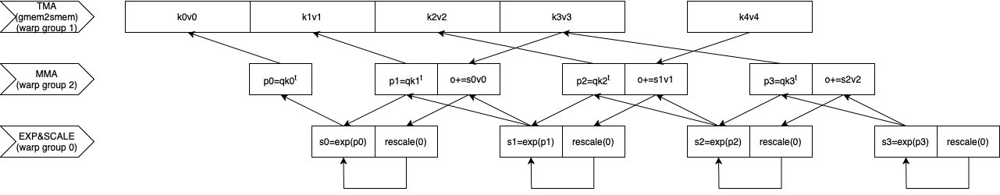
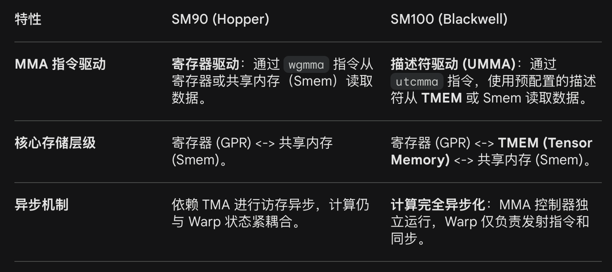
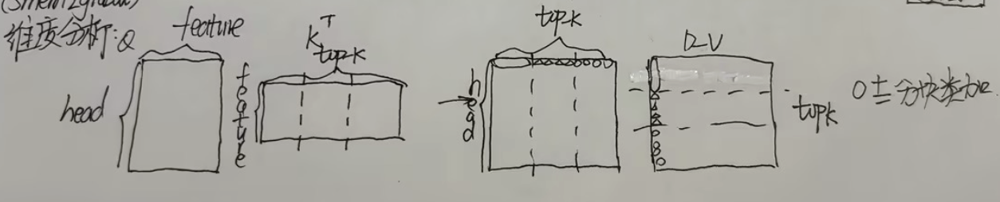
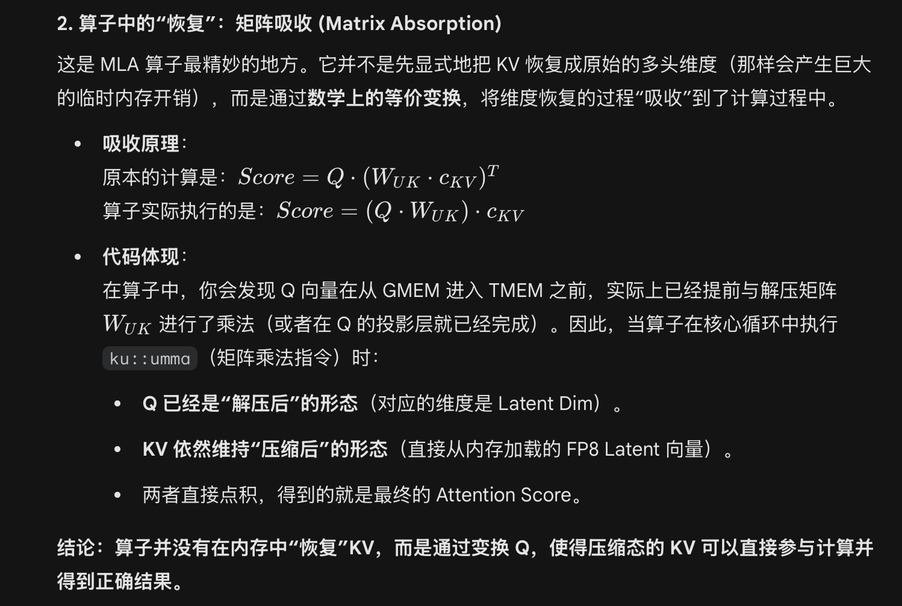
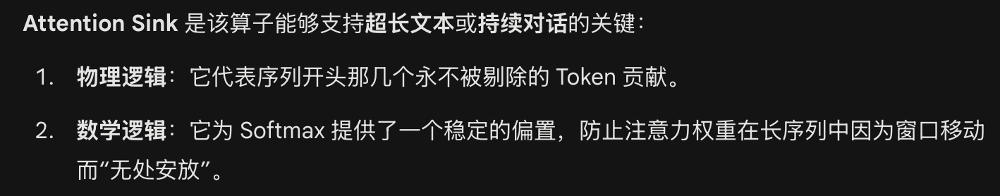
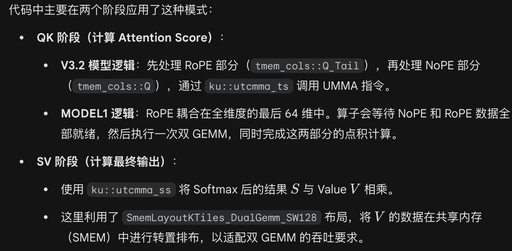
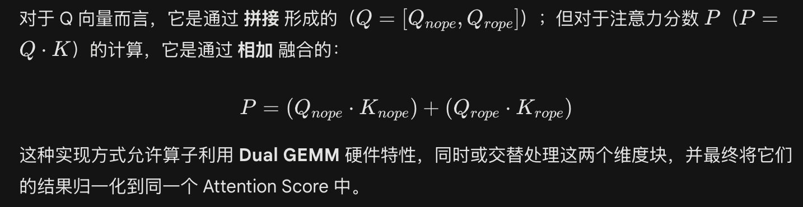

# flash\_mla

- Flash-mla算子总结：

# Flash-MLA（prefill）

算子输入输出：

struct SparseAttnFwdParams {

int s\_q, s\_kv, h\_q, h\_kv, d\_qk, d\_v, topk;

float sm\_scale, sm\_scale\_div\_log2;

// Input tensors

cutlass::bfloat16\_t\* \_\_restrict\_\_ q;    // \[s\_q, h\_q, d\_qk\]

cutlass::bfloat16\_t\* \_\_restrict\_\_ kv;   // \[s\_kv, h\_kv, d\_qk\]

int\* \_\_restrict\_\_ indices;   // \[s\_q, h\_kv, topk\]

float\* \_\_restrict\_\_ attn\_sink;   // \[h\_q\], may be nullptr

int\* \_\_restrict\_\_ topk\_length;    // \[s\_q\], may be nullptr

// Strides

int stride\_q\_s\_q; int stride\_q\_h\_q;

int stride\_kv\_s\_kv; int stride\_kv\_h\_kv;

int stride\_indices\_s\_q; int stride\_indices\_h\_kv;

// Output tensors

cutlass::bfloat16\_t\* \_\_restrict\_\_ out;   // \[s\_q, h\_q, d\_v\]

float\* \_\_restrict\_\_ max\_logits; // \[s\_q, h\_q\]

float\* \_\_restrict\_\_ lse; // \[s\_q, h\_q\]

int num\_sm;

cudaStream\_t stream;

};

# gridDim(s\_q, 1, 1) // 一个block负责一个query token

# // Q(head\_num, head\_size) @ K(head\_size, top\_k) ...... @ V(top\_k, v\_size) -> (head\_size, v\_size)

# blockDim(NUM\_THREADS, 1, 1)

| warp\_idx | warp\_group\_idx | 角色 | 任务 |
| --- | --- | --- | --- |
| 0 | 0 | 控制 | 初始化；加载query |
| 1 | 0 | softmax | exp / max / scale |
| 2 | 0 | softmax | exp / max / scale |
| 3 | 0 | softmax | exp / max / scale |
| 4 | 1 | KV loader | TMA gather |
| 5 | 1 | KV loader | TMA gather |
| 6 | 1 | KV loader | TMA gather |
| 7 | 1 | KV loader | TMA gather |
| 8 | 2 | MMA 主核 | 注意力计算 |
| 9 | 2 | 控制 | mask生成 |
| 10 | 2 | RoPE loader | cp.async |
| 11 | 2 | RoPE loader | cp.async |

# 三缓冲及流水依赖关系：

| Barriers名称 | 作用 |
| --- | --- |
| bar\_prologue\_q/utccp\_n/rope | 预处理阶段q是否被加载到smem/tmem |
| bar\_qk\_n/rope\_done\[NUM\_BUFS\] | qk计算结果p是否写入tmem |
| bar\_sv\_done\[NUM\_BUFS\] | sv计算结果o是否在tmem中更新，释放smem中的v,s |
| bar\_kv\_n/rope\_ready\[NUM\_BUFS\]\[2\] | kv数据是否被加载到smem |
| bar\_p\_free | p是否被计算s用完，释放tmem中的p |
| bar\_so\_ready | s是否写入smem，o是否在tmem中完成更新 |
| bar\_k\_valid\_ready/free\[NUM\_BUFS\] | top-k索引有效性掩码是否写入smem |

# 上图中所有箭头都可以和Barriers名称对应，除了图中最后一行之间的箭头，因为在同一线程内，通过寄存器变量should\_scale\_o直接判断。

# 其中箭头表示生产者消费者之间的关系（箭头表示生产者，箭尾表示消费者）或地址依赖关系。

# 首先将kivi从gmem搬到smem，warp8计算出pi后存放在tmem；接着WG0读到寄存器进行局部规约和求和，然后读到smem进行全局规约得到si；然后在tmem对o进行原地rescale；最后从smem读取sivi将结果存入tmem与o原地加和。

# 因为涉及读写同一块内存，因此需要产生依赖，先看内存分布：

# 1.smem：存储KV(bf16)，存在k\_nope\[3\]中（三缓冲），因此搬运k3v3时需要消费者读完k0v0（尤其是v0），这通过Barriers去监控。

# 存储中间结果s（bf16），mma作为生产者产生pi（q@ki）后，将pi从tmem读到寄存器，做exp后放入smem，等着mma读它和vi做矩阵乘。

struct SharedMemoryPlan {

union {

struct {

array\_aligned<bf16, cosize\_v<SmemLayoutKRoPE>> \_k\_rope\_pad;

array\_aligned<bf16, cosize\_v<SmemLayoutKNoPE>> \_k\_pad\[2\];   // So that q\_nope covers k\[2\]

array\_aligned<bf16, cosize\_v<SmemLayoutQNoPE>> q\_nope;

} q\_full;

struct {

array\_aligned<bf16, cosize\_v<SmemLayoutKRoPE>> k\_rope;

array\_aligned<bf16, cosize\_v<SmemLayoutKNoPE>> k\_nope\[NUM\_BUFS\];

} k;

array\_aligned<bf16, cosize\_v<SmemLayoutO>> o;

} u;

float p\_exchange\_buf\[4\]\[32 \* (B\_TOPK/2)\];

union {

bf16 s\[B\_H\*B\_TOPK\];

array\_aligned<bf16, cosize\_v<SmemLayoutQRoPE>> q\_rope;

} s\_q\_rope;

char is\_k\_valid\[NUM\_BUFS\]\[B\_TOPK/8\];

transac\_bar\_t bar\_prologue\_q\_nope, bar\_prologue\_q\_rope, bar\_prologue\_utccp\_nope, bar\_prologue\_utccp\_rope;

transac\_bar\_t bar\_qk\_nope\_done\[NUM\_BUFS\], bar\_qk\_rope\_done;    // Pi = QKi^T (the nope part) done

transac\_bar\_t bar\_sv\_done\[NUM\_BUFS\];    // O += SiVi done (i.e. O, Si and Vi are free)

transac\_bar\_t bar\_kv\_nope\_ready\[NUM\_BUFS\]\[2\], bar\_kv\_rope\_ready;

transac\_bar\_t bar\_p\_free;

transac\_bar\_t bar\_so\_ready;   // S and O are ready

transac\_bar\_t bar\_k\_valid\_ready\[NUM\_BUFS\], bar\_k\_valid\_free\[NUM\_BUFS\];

array\_aligned<uint32\_t, 1> tmem\_start\_addr;

float rowwise\_max\_buf\[128\], rowwise\_li\_buf\[128\];

};

| 地址空间 | 初始阶段(Prologue) | 循环阶段(Main Loop) | 结束阶段(Epilogue) |
| --- | --- | --- | --- |
| union u | q\_nope | k\_nope\[0, 1, 2\] | o |
| union s\_q\_rope | q\_rope | s |  |
| exchange area |  | p |  |
| control area | 初始化各类屏障 | 维护生产者/消费者信号 |  |

# float p\_exchange\_buf\[4\]\[32 \* (B\_TOPK/2)\];

# 这是为了跨线程束交互数据，tmem中的p分布在不同线程束中。该内存在softmax阶段启用，用于规约。4指4个线程束，（B\_TOPK/2）指每个线程负责的元素数量。

# 2.tmem（不是通过指针寻址，而是列槽位）：存储q（bf16 固定），o（fp32 原地计算），qki的结果pi（fp32 没有多缓冲）

# 向tmem中写入pi+1时需要判断pi已经被计算si读完：

# WG0读取pi后，bar\_p\_free.arrive()

# warp8写入pi+1前，bar\_p\_free.wait()

// Tensor memory columns

namespace tmem\_cols {

//   0 ~ 256: output

// 256 ~ 400: Q

// 400 ~ 464: P

constexpr int O = 0;

constexpr int Q = 256;

constexpr int Q\_RoPE = 256 + 128;

constexpr int P = 400;

}

# 可能prefill算子结束之后会对kv进行一次量化，因为decode算子有一个fp8到bf16的反量化过程

- sm100芯片架构：

**1．存算层级：tmem**

**传统架构 (Hopper)**：数据流是 Global Memory -> Shared Memory -> Register -> Tensor Core。Wmma中Fragment不对应单独的硬件单元，本质上也是寄存器单元，寄存器压力（Register Pressure）是性能瓶颈。

**Blackwell (SM100)**：引入了 **TMEM (Tensor Memory)**。它一块独立于寄存器和共享内存的高速存储区域，专为 Tensor Core 设计。它像是一个“矩阵寄存器池”，允许矩阵乘法的结果直接留在 TMEM 中，而不必反复写回寄存器或共享内存。极大地缓解了寄存器溢出，支持更大规模的 Tile 计算。Softmax 缩放（Scale）和  乘法直接在 TMEM 上原地操作。

2.第五代tensor core:

支持fp4精度。

3.第二代TMA (Tensor Memory Accelerator)：

**硬件级 Gather/Scatter**：支持不连续内存地址的异步搬运，是针对稀疏注意力的硬件级优化。（DeepSeek 的 Phase 1 能够快速从全局显存抓取稀疏的 KV Token，全靠这个硬件加速器）

4. **UMMA (Universal Matrix Multiply-Accumulate)万能矩阵指令：**

**可以直接写入** **TMEM** **或寄存器，利用** **TMEM** **实现跨线程组的数据共享，效率极高。**

**注意：**

**为什么prefill阶段这么大的计算量，mma只有warp8在“执行”，而exp,scale部分由一整个warp group执行？**

- **MMA运算：sm100引入了异步指令发射机制，Warp 8 发射** **ku::utcmma** **指令后，任务被移交给** **MMA 控制器。一旦指令入队，硬件会自动从** **TMEM** **读取数据并在 Tensor Core 上执行计算。Warp 本身不参与乘加操作，只需负责“下达命令”，因此一个 Warp 就足以维持硬件的吞吐量。**

- **exp、log** **和** **scale** **等运算主要依赖 CUDA Core 或专用的算术单元。这些运算需要每一个线程实实在在地执行指令，无法像矩阵乘法那样完全“托管”给控制器。为了隐藏访存延迟并提高并行度，必须动用整个** **Warpgroup** **来并行处理多行数据。代码中通过** **NamedBarrier** **和共享缓冲区（rowwise\_max\_buf）在 128 个线程间进行规约操作。**

**与sm90架构及在sm90上实现该算子的对比：**

**对于指令和运算解耦的思考：**

- **sm90:** **在 SM90 中发射一个** **wgmma** **指令时，它已经是异步的了。这意味着 Warp 发射完指令后，不需要等 Tensor Core 算完就可以去干别的事。虽然指令是异步的，但计算结果（累加器）必须写回到发射指令的那个 Warpgroup 的通用寄存器 (GPR)** **中。**

- **sm100:** **引入了** **TMEM (Tensor Memory)** **和全新的** **UMMA** **指令集，实现了彻底的解耦。**

- 流水线管理：

- 为什么不用cuda::make\_pipeline及其生产者消费者逻辑：

用了更细粒度的底层原语，及各个指令间的互相依赖（通过barrier屏障），更重要的是cuda::make\_pipeline通常假设生产者和消费者是同一个 Warp。而这段代码将线程分成了完全不同的角色（Warp 0-3 算 Softmax，Warp 4-7 搬运，Warp 8-11 算 MMA）。

生产者消费者逻辑本质上是一种依赖判定，当 TMA 想要写 Slot 0，但 Tensor Core 可能还没算完 Slot 0 的数据时，硬件通过 **mbarrier (Matrix Barrier)** 机制进行同步。

- 生产者逻辑：

在 KV 生产者 Warp 中，代码驱动 TMA 异步加载数据：

ku::tma\_gather4(..., plan.bar\_kv\_nope\_ready\[cur\_buf\]\[part\_idx\], ...);

这里的 plan.bar\_kv\_nope\_ready 就是一个依赖判定的屏障。当 TMA 完成搬运，硬件会自动增加屏障的计数值。

- 消费者逻辑：

在计算 Warp 中，它会显式等待这个屏障：

plan.bar\_kv\_nope\_ready\[cur\_buf\]\[kv\_nope\_part\_idx\].wait((k/NUM\_BUFS)&1);

只有当 TMA 确认数据已经在 SMEM 中写好了，MMA 引擎才会启动 ku::utcmma\_ts。

在 MMA 计算完成后，它会通过屏障通知生产者，这个 Buffer 现在可以被覆盖了：

plan.bar\_p\_free.arrive(); // 释放 P 矩阵占用的 TMEM 空间

2.对该算子计算流程的理解：

每一步的存储位置具体如下：

- 预处理与加载阶段（Prologue）

Query: gmem (by TMA)-> smem -> tmem

Top-K索引: gmem -> reg

- 主循环阶段（Main Loop-Tiling）

Key/Value: gmem -> smem

Pi = QKiT: Q(tmem), Ki(smem) -> tmem

S = Softmax(Pi): tmem -> smem（这一步在cuda core完成）

O = rescale(O)：tmem -> tmem

O = O + SiVi: Si(smem), Vi(smem) -> tmem

- 收尾与写回阶段（Epilogue）

O归一化： tmem(归一化) -> smem(by TMA) -> gmem

- 算法计算流程及mla理解：

Query是多头的，key和value被压缩成了“单头”，相较于mha进行了压缩，比如：

**MHA 的 KV**：\[64, 128\]  8192 个元素。

**MLA 的 KV**：\[512\] (Latent)  512 个元素。

Prefill阶段，对于选取top-k（mask作为输入）是稀疏的，但算子执行矩阵乘时是稠密的。

FlashMLA/csrc/sm100/decode/head64/kernel.cuh

算子输入输出：

struct SparseAttnDecodeParams {

int b, s\_q;

int h\_q, h\_kv;

int d\_qk, d\_v;

float sm\_scale, sm\_scale\_div\_log2;

int num\_blocks, page\_block\_size, topk;

ModelType model\_type;

// input tensor

cutlass::bfloat16\_t\* \_\_restrict\_\_ q;   // \[b, s\_q, h\_q, d\_qk\]

cutlass::bfloat16\_t\* \_\_restrict\_\_ kv;  // \[num\_blocks, page\_block\_size, d\_qk\]

int\* \_\_restrict\_\_ indices;   // \[b, s\_q, topk\]

int\* \_\_restrict\_\_ topk\_length;  // \[b\], may be nullptr

float\* \_\_restrict\_\_ attn\_sink;  // \[h\_q\], may be nullptr

// no\_split output tensor

float\* \_\_restrict\_\_ lse;    // \[b, s\_q, h\_q\]

cutlass::bfloat16\_t\* \_\_restrict\_\_ out;   // \[b, s\_q, h\_q, d\_v\]

int extra\_num\_blocks, extra\_page\_block\_size, extra\_topk;

cutlass::bfloat16\_t\* \_\_restrict\_\_ extra\_kv;  // \[extra\_num\_blocks, extra\_page\_block\_size, d\_qk\]

int\* \_\_restrict\_\_ extra\_indices;   // \[b, s\_q, extra\_topk\]

int\* \_\_restrict\_\_ extra\_topk\_length;  // \[b\], may be nullptr

int stride\_q\_b, stride\_q\_s\_q, stride\_q\_h\_q;

int stride\_kv\_block, stride\_kv\_row;

int stride\_indices\_b, stride\_indices\_s\_q;

int stride\_lse\_b, stride\_lse\_s\_q;

int stride\_o\_b, stride\_o\_s\_q, stride\_o\_h\_q;

int stride\_extra\_kv\_block, stride\_extra\_kv\_row;

int stride\_extra\_indices\_b, stride\_extra\_indices\_s\_q;

cudaStream\_t stream;

// SplitKV-related parameters

// split output tensors

float\* \_\_restrict\_\_ lse\_accum;  // \[num\_splits, s\_q, h\_q\]

float\* \_\_restrict\_\_ o\_accum;    // \[num\_splits, s\_q, h\_q, d\_v\]

int stride\_lse\_accum\_split, stride\_lse\_accum\_s\_q;

int stride\_o\_accum\_split, stride\_o\_accum\_s\_q, stride\_o\_accum\_h\_q;

DecodingSchedMeta\* \_\_restrict\_\_ tile\_scheduler\_metadata\_ptr; // \[num\_sm\_parts, \], contiguous

int\* \_\_restrict\_\_ num\_splits\_ptr; // \[batch\_size+1, \], contiguous

int num\_sm\_parts;

};

gridDim(s\_q, num\_sm\_parts, 1)

// decode s\_q = 1

// num\_sm\_parts取决于硬件SM数量，指将KV分块的数量

// prefill阶段对query token 进行了切分

// decode阶段是对KV进行切分

// 并行的来源：Batch的并发以及KV缓存的切分（seqlen=1）

blockDim(NUM\_THREADS, 1, 1)

| WarpID | WDID | 角色 | 任务 |
| --- | --- | --- | --- |
| 0 | 0 | softmax | Exp/max/scale |
| 1 | 0 | softmax | Exp/max/scale |
| 2 | 0 | softmax | Exp/max/scale |
| 3 | 0 | softmax | Exp/max/scale |
| 4 | 1 | MMA controller | 注意力计算 |
| 5 | 1 | TMA Nope | 搬运数据 |
| 6 | 1 | TMA Rope | 搬运数据 |
| 7 | 1 | Index ,quant scale loader | 计算索引，提取量化因子 |
| 8 | 2 | Dequant | 反量化 |
| 9 | 2 | Dequant | 反量化 |
| 10 | 2 | Dequant | 反量化 |
| 11 | 2 | Dequant | 反量化 |

Warp7 计算稀疏索引和scale，要跑在最前面，因此索引存储用了4缓冲

(plan.scales\[rs.index\_buf\_idx\]\[row\_idx\])

Warp5,6 搬运kv数据，用了双缓冲

Warp8-11 写反量化后的fp16数据，用了双缓冲（dequant\[rs.buf\_idx\]）

注意：

1.算子对kv进行了切分，每个thread block只拿到了一部分的KV,计算出的结果虽然尺寸对，但信息不全，需要一个后续的combine 算子。

2.由于key的维度（512）中，有一部分ROPE和一部分NOPE，两部分维度不同，且存在存储精度（带位置编码的特征维度小，以bf16存储（带位置编码，量化后精度误差大），不带位置编码的以fp8存储，还需要进行反量化）、获取路径上的不同，这里采用Dual GEMM同时处理这两部分。

3.decode算子的输出：**每个分片的局部注意力加权和**以及**局部的归一化系数。**

Deepseek tips:

1.attention sink：

2.dual gemm:

