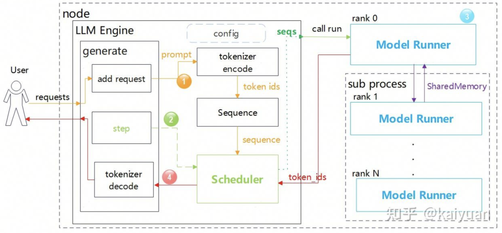
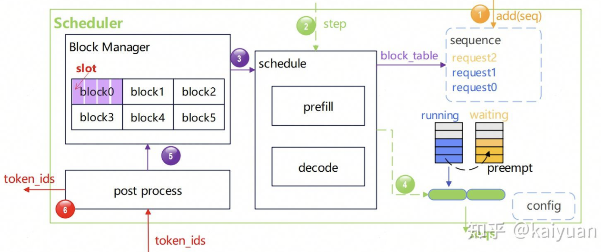
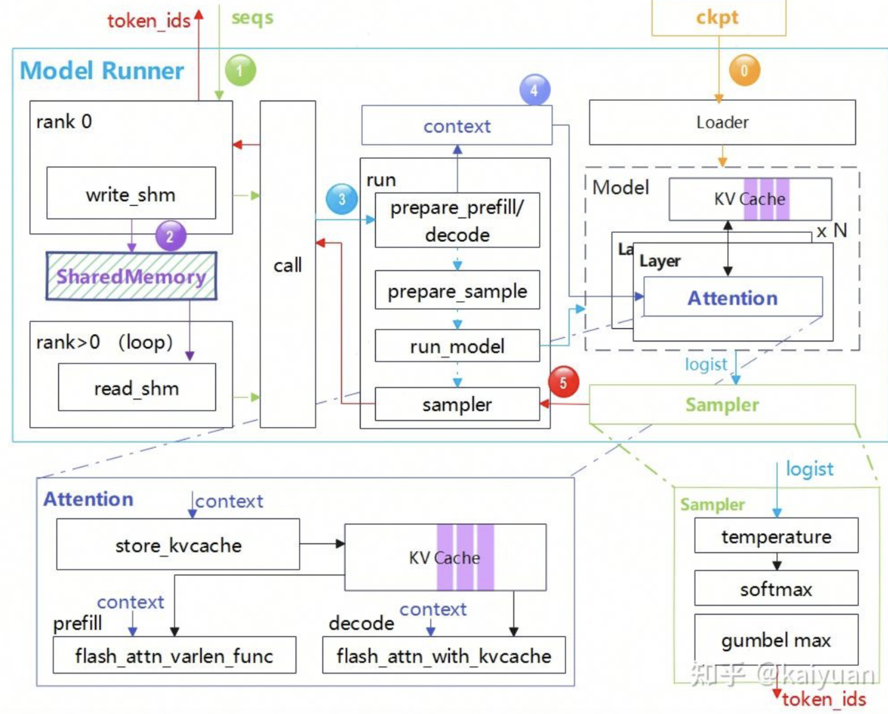
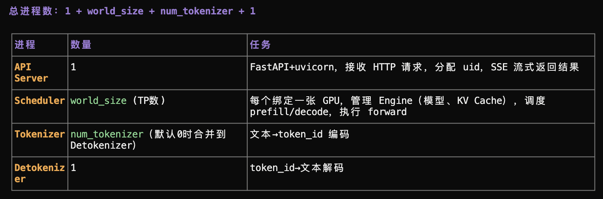
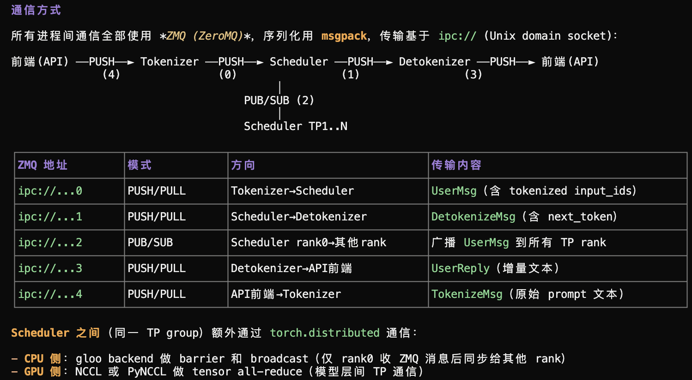
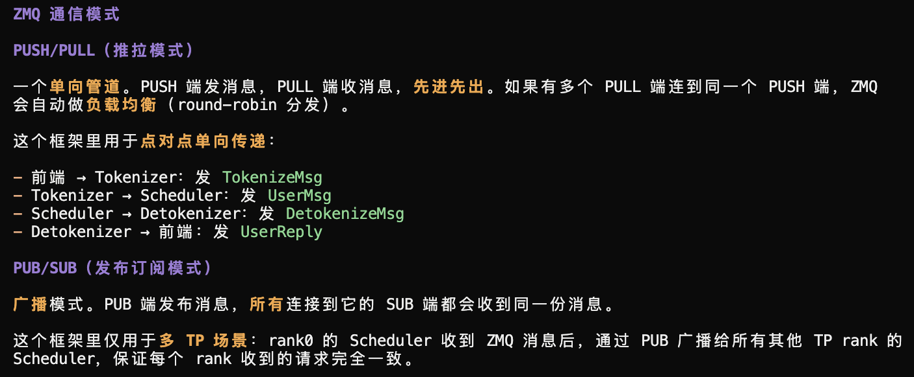
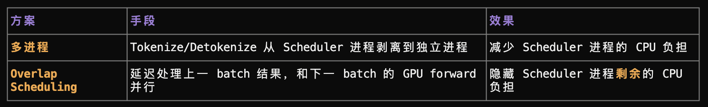
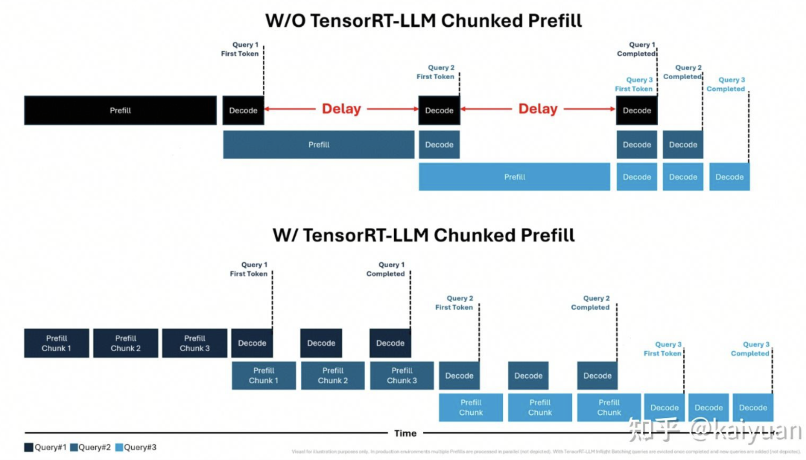
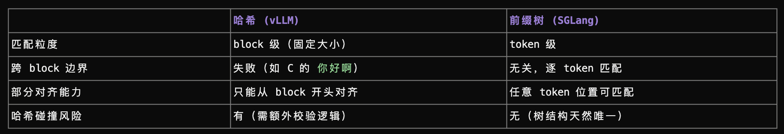

# 推理框架学习

**Nano-vllm轻量化推理框架学习**

**一.整体框架及关键组件：**

Nano-vLLM是一款轻量级推理框架，实现了Paged Attention、Continuous batching、Prefix caching等特性，同时支持在单节点内以张量并行（Tensor Parallelism，TP）方式运行。代码总量约1.2k行，Decode阶段支持CUDA Graph。关键组件如下：

（1）LLM\_Engine：顶层模块，创建推理服务所需的所有模块，提供处理用户请求的接口（generate），并完成请求数据的编码、执行与解码过程。

（2）Block Manager：基于PagedAttention原理管理KV cache的显存。

（3）Scheduler：通过队列维护待执行的请求，组织并下发每一步需要执行的请求。

（4）Model Runner：加载并运行模型，完成每个请求的运算。当TP > 1时，主进程会启动多个Model Runner实例，共同完成前向计算。

**二．组件详细解释：**

**2.1 LLM\_Engine：**

LLM Engine（LLM引擎）是推理框架的核心模块，它会创建一个Scheduler实例和至少一个Model Runner实例。其主要逻辑封装在generate函数中，数据在各模块之间通过参数传递。请求的资源分配在Scheduler中完成，前向运算在Model Runner中完成。其中，第一个Model Runner创建在主进程中，其他Model Runner创建在子进程中，主进程与子进程之间通过共享内存进行通信。执行步骤如下（结合下图说明）：

- 接收到用户请求后，通过tokenizer将prompt编码为token ids，并为每个请求创建一个Sequence实例。

- 调用step函数触发调度器执行，调度器将待执行的请求数据传递给Model Runner。若存在多个Model Runner，数据仅传输给rank 0的Model Runner。

- 在Model Runner中完成模型的前向计算，获得生成的token ids。

- 将token ids解码为字符串并返回给用户，同时调度器释放相应资源。

**2.2 Scheduler：**

Scheduler（调度器）负责请求的下发与执行组织，内部维护两个队列：running队列和waiting队列，多个请求在这两个队列之间轮转。调度逻辑默认采用prefill优先策略，即当收到新的prefill请求时，可打断当前正在进行的decode执行，被中断的请求将被移入 waiting队列。抢占逻辑为：当请求执行资源不足时，按照入队顺序将running队列中后进入的请求转移至 waiting队列。

调度器内部会创建Block Manager实例，用于为请求分配KV cache blocks。其主要执行步骤如下（结合下图说明）：

- 接收到新请求后，将其加入等待队列。

- 执行step，分为prefill和decode两个阶段。

- 为即将执行的请求分配blocks，信息记录在block table中。

- 打包当前需要执行的请求数组seqs。

- 前向计算完成后进行后处理，释放已结束请求占用的KV cache资源。

- 将 token ids返回给tokenizer解码。

**2.3**  **Model Runner**

Model Runner（模型执行器）主要完成模型的前向运算。当TP > 1时，通过multiprocessing管理各rank之间的协作。rank 0创建的Model Runner接收seqs数据，并通过SharedMemory与其他进程共享该数据，仅rank 0返回计算结果。Model Runner的关键函数为run。执行步骤如下（结合下图说明）：

0.推理服务启动时，需完成模型参数加载、KV cache创建及预热。

1.rank 0接收来自调度器的待执行请求。

2.rank 0将请求数据写入SharedMemory，其他rank通过循环调用loop函数读取SharedMemory，在读取到请求数据seqs后启动执行。

3.Model Runner执行run操作，包括数据准备、模型执行和logits采样。

4.在准备阶段会创建context数据，该数据主要用于Attention阶段的计算，为flash\_attention算子提供入参。

5.模型前向计算得到的logits经采样器完成采样，采样结束后返回token ids。

在Attention阶段，KV cache会通过store\_kvcache函数写入KV cache tensor中；Attention计算根据当前是prefill还是decode阶段调用不同的FA算子。目前采样的计算过程为：温度、softmax和gumbel max计算。

**三．代码解释**

**3.1 使用到的外部模块：**

采用PyTorch实现模型层，使用torch.distributed处理分布式计算；

采用flash\_attn构建Attention模块，利用transformer的AutoTokenizer进行编码和解码；

使用multiprocessing的SharedMemory进行数据协同，用Event完成各Rank之间的同步；

使用triton 库自定义KV cache存储函数，实现KV cache的快速写入；

利用safetensors库的safe\_open构建模型参数加载函数。

**3.2 代码组织：**

nanovllm.engine：框架关键模块定义位置，包含Sequence、Scheduler、ModelRunner、BlockManager等。

nanovllm.layers：模型层实现，如activation、attention、linear、embedding、sampler等。

nanovllm.models：具体模型结构实现，当前仅支持Qwen3模型。

nanovllm.sampling\_params：定义SamplingParams以存储采样参数。

nanovllm.config：定义框架运行基本参数，如max\_num\_batched\_tokens、max\_num\_seqs、gpu\_memory\_utilization等。

nanovllm.utils：实现Context与load\_model。每个进程仅实例化一个Context。

四．补充问题

1. 为什么仅在decode阶段使用CUDA Graph?

CUDA Graph的加速要求输入尺寸固定，这样才能利用图缓存来提升性能。在decode阶段，每个请求的输入长度始终为1，其他输入保持不变，这种固定输入格式适合使用图缓存；而prefill阶段的计算长度不固定，若要构造图缓存，需要较大的显存空间和初始化时间，因此通常不支持CUDA Graph加速。

解释：引擎（如 vLLM）在启动时，会把模型前向传播的所有算子、内存地址提前录制成一张“静态图”（CUDA Graph Capture）。后面推理时，CPU 只需要发送一个总指令，GPU 就会自己把整张图跑完，从而极大地提升了吞吐量（Throughput）。

--enforce-eager：强制关闭CUDA Graph。

**vLLM Scheduler 学习1**

要支持的功能：continuous-batching;prefill,decode执行优先级控制（默认prefill优先）；decode阶段资源不足时发生抢占（后进入的请求被排出）。

未学习的功能：prefill,decode混合执行；chuncked prefill；kv connector；异步下发；priority等。

/lzh/InfraTech/llm\_infer/vllm\_basic\_scheduler.ipynb

**问题汇总：**

**1. 为什么两句话完全不同，分词器输出的结果有大量重复？**

两句话会被 tokenize 成：

<\|im\_start\|>user\\nHi, I'm lizihan<\|im\_end\|>\\n<\|im\_start\|>assistant\\n

<\|im\_start\|>user\\nWho are you?<\|im\_end\|>\\n<\|im\_start\|>assistant\\n

Token 序列中完全相同的前缀和后缀是角色标签和分隔符。

**2. \`@dataclass\` 是什么？**

\`@dataclass\` 是 Python 3.7 引入的装饰器（\`dataclasses\` 标准库），自动生成 \`\_\_init\_\_\`、\`\_\_repr\_\_\`、\`\_\_eq\_\_\` 等样板方法，只需声明字段和默认值。

**3. 为什么浅拷贝能防外部修改**

\`copy(token\_ids)\` 创建新 list 对象。外部对原 list 的增删不影响新 list。由于 \`token\_ids\` 是 \`list\[int\]\`（元素不可变），浅拷贝完全足够。

**4. \`@property\` 是什么意思？**

把方法伪装成属性访问——调用方不需括号。计算值由其他字段派生，不占存储，语义清晰。

**5. Prefill 优先与 Continuous Batching：**

每轮 \`schedule()\` 先尝试 prefill（处理新请求），prefill 有产出就用 prefill 批次；prefill 没产出（waiting 为空或资源不够）才退而 decode。prefill 和 decode 不同时混合在同一批次。prefill 优先是实现 Continuous Batching 的前提条件。

**6.抢占（Preemption）机制：**

抢占只在 decode 阶段发生，触发条件为\`can\_append(seq)\` 返回 False（token 越过 block 边界 + 无空闲 block）。prefill 阶段资源不够时是 \`break\`（本轮不调度），不是 preempt。不存在 "prefill 抢占 decode" 的设计。

若没有swapped队列，被抢占后必须从 prefill 重新开始，之前decode生成的token和prompt一起作为这次prefill的输入，即已生成 token 不作废。

**7. token\_ids 的物理存储**

\`token\_ids\` 始终在CPU RAM（Python 堆），从未搬上 GPU。抢占后，CPU 侧 token\_ids 不变，GPU 侧 block 归还 free 池。必须完整重新 prefill——输入还在，但"计算结果"（KV cache）已丢弃。完整的vLLM 还有 swap preemption，将 KV cache 从 GPU 交换到 CPU 内存，避免重算。

**8.资源：**

Token预算：算力瓶颈

Block资源：访存瓶颈

Prefill阶段两者都检查：

if self.num\_batched\_tokens + len(seq) > self.max\_num\_batched\_tokens \\

or not self.block\_manager.can\_allocate(seq):

break

Decode阶段只查Block资源，不足时倒序抢占：

while not self.block\_manager.can\_append(seq):

if self.running:

self.preempt(self.running.pop())

**mini SGLang 学习**

**一、支持的功能：**

1、Overlap Scheduling：CPU 调度与 GPU 计算重叠

2、Chunked Prefill：分块预填充，避免长请求阻塞

3、Radix Cache：前缀复用，减少重复计算

4、CUDA Graph：消除 Python 开销，加速推理

**二、细节探究：**
1、多进程架构及ZMQ通信

多进程架构设计的考量：（多核CPU是前提）

Tokenization 是 CPU-bound 任务，会阻塞整个流水线；分离后可以实现真正的并行处理；某个组件崩溃不会影响其他组件。

2、Overlap Scheduling机制原理：

3、Chunked Prefill的原理及实现：

在推理框架中，主要改动点是调度器(Scheduler)的逻辑，保证多次分块的prefill请求能够衔接起来。通过控制每个请求本轮需要计算的tokens数量，实现任意chunk大小的组合下发。

4、Radix Cache的实现及与vllm中prefix cache的区别：

