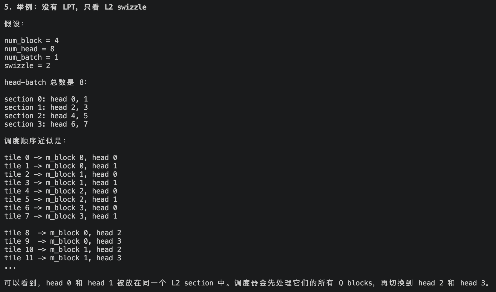
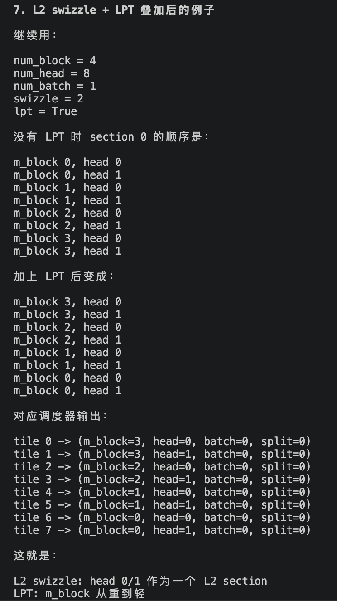
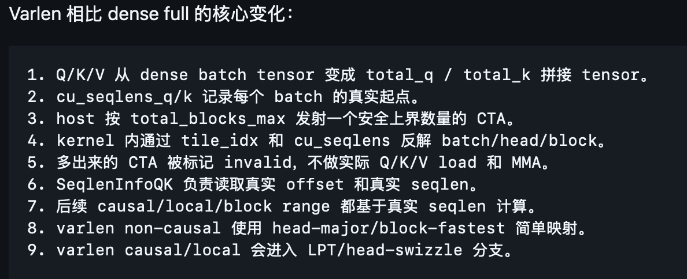
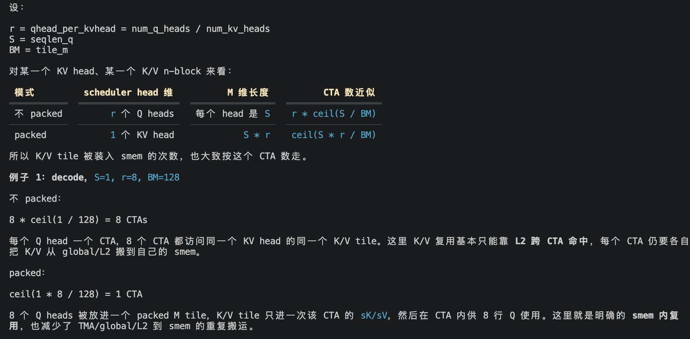
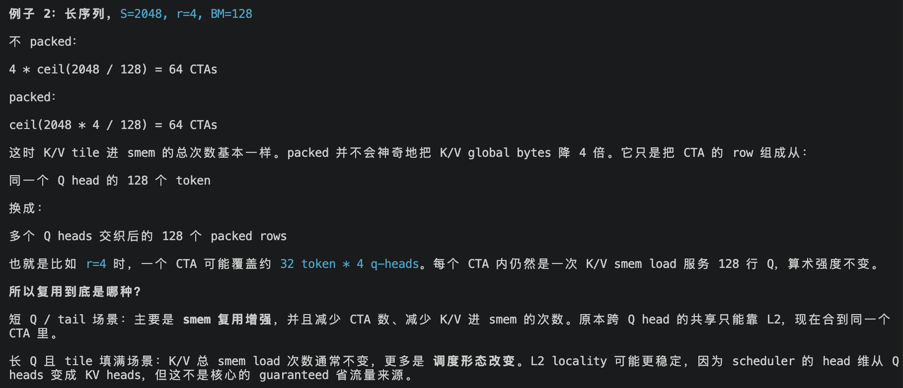
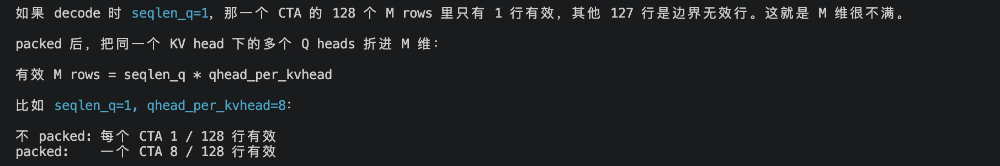

# 通过fa看负载均衡

**通过flash-attention看负载均衡**

核心代码：flash\_attn/cute/tile\_scheduler.py

- **针对因果掩码的负载均衡（SingleTileLPTScheduler）**

Grid((m\_block \* head \* batch), split, 1)

（1）SM90 \_\_call\_\_ 中会把 dense tensor 变成更适合 kernel 的布局：

Q/O:  \[batch, seqlen, head, dim\] -> \[seqlen, dim, head, batch\]

K/V:  \[batch, seqlen, head, dim\] -> \[seqlen, dim, head, batch\]

LSE:  \[batch, head, seqlen\]      -> \[seqlen, head, batch\]

（2）LPT（Longest Processing Time first）：

核心操作是把Q\_block顺序反过来，让重CTA优先被调度，轻CTA填空收尾。

（3）L2 swizzle：

核心操作是重排CTA 对 (m\_block, head, batch) 的访问顺序，让 K/V 数据更容易在 L2 cache 中被复用。相当于是不再是Q\_block优先考虑，去查所有KV\_block，而是KV head优先考虑，被所有Q\_block查。

（4）举例说明：

- **针对变长序列的负载均衡（SingleTileVarlenScheduler）**

Grid((total\_blocks\_max \* head), split, 1)

**flash-attention的变体**

- **GQA/MQA**

**核心目标**：减轻KV搬运的瓶颈，提升KV复用率（针对decode等少q\_selen情况有提升）

**方案**：引入packed GQA，将调度坐标又按q\_head转换为按kv\_head

(m\_block, q\_head, batch, split)-> (m\_block\_packed, kv\_head, batch, split)

其中m\_block\_packed = m\_block \* qhead\_per\_kvhead。

packed GQA 主要把一部分原本只能靠 L2 命中的跨 CTA K/V 复用，变成 CTA 内的 shared memory 复用；但它不是在所有长度下都减少 K/V 总加载次数。**收益最大的是短 seqlen\_q、decode/prefill 小Q、以及tail很多的场景**。

由于ceil(S \* r / BM) < r \* ceil(S / BM)，因此当 S 小或尾块浪费大时成立得很明显；当 S 很大且整除 tile 时，两边接近甚至相等，packed 的收益就更多依赖调度、cache locality、特定kernel 路径，而不是 K/V load 次数本身。

